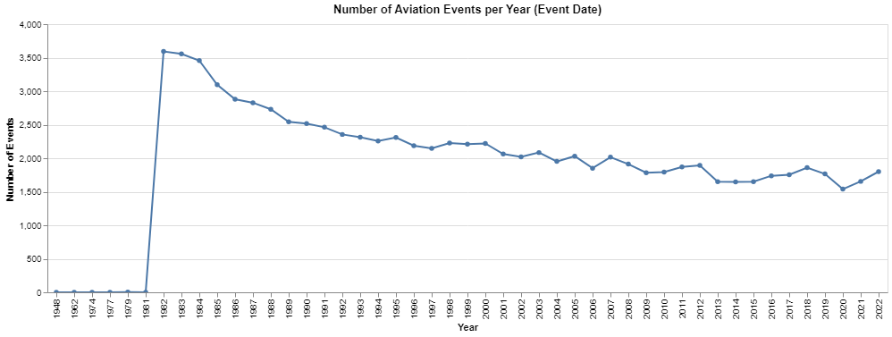

# Aviation Risk Assessment Project

## Overview

This project dives deep into aviation incident data to help a company venturing into the airline industry identify the lowest-risk aircraft to invest in. Through structured data cleaning, analysis, and visualization, this notebook translates raw data into business intelligence tailored for high-stakes decision-making.

##  Business Understanding

**Scenario:**  
Your company is exploring new business verticals and is considering investing in aviation for commercial and private purposes. However, the risk factors associated with different aircraft types remain unknown. As a data analyst, your mission is to identify which aircraft categories and conditions result in the least severe outcomes in incidents.

**Stakeholder:**  
Head of the new aviation division, who will use this data-driven insight to inform strategic procurement decisions.

**Key Questions:**
- Which aircraft categories are linked to higher injury severity?
- Does weather condition impact the severity of incidents?
- Which flight purposes tend to be riskier?
- How have incidents trended over time?

## Data Understanding and Analysis

**Data Source:**  
U.S. National Transportation Safety Board (NTSB) aviation incident records (CSV/XLSX format).

**Key Columns:**
- `Event_Date`, `Location`, `Aircraft_Category`, `Injury_Severity`, `Weather_Condition`, `Purpose_of_flight`, etc.

**Cleaning Steps:**
- Filled missing numerical and categorical data.
- Dropped columns with over 80% missing data.
- Removed illegal characters that could corrupt Excel output.
- Added derived fields such as `Year` and `Injury_Severity_Categorized`.

## Key Visualizations

### 1. Events Per Year
This line chart shows the trend of aviation events over the years, highlighting spikes or dips in incident frequency.

---

### 2.  Injury Severity by Aircraft Category
This bar chart identifies which aircraft categories experience the most severe outcomes.

---

### 3.  Injury Severity by Weather Condition
Visualizing how weather conditions correlate with incident severity.

---

## Conclusion

###  Summary of Findings:
- **Helicopters and Experimental Aircrafts** showed a higher proportion of fatal incidents.
- **Good weather** does not guarantee low risk — many severe incidents still occurred under clear conditions.
- **Personal and Instructional flights** experienced a disproportionately higher rate of severe incidents.

### Recommendation:
Start with investing in **Multi-engine Land** aircraft used for **Business or Commuter** purposes under **favorable weather**, as they showed lower incident severity in historical data.

---

## Project Files

- [Final Notebook](./Doreen_project.ipynb)
- [Presentation (PDF)](./Doreen_Wathimu_Aviation_Risk_Insights_Presentation.pdf)
- [Cleaned Dataset (CSV)](./Aviation_Data_Cleaned.csv)
- [Dashboard (Tableau Public)]([insert your Tableau Public link here!](https://public.tableau.com/app/profile/doreen.wathimu/viz/DW-PHASE-ONE-TABLEAU/Dashboard1?publish=yes))

---

##  Author

**Doreen Wathimu**  
📧 [wathimugitari@gmail.com](mailto:wathimugitari@gmail.com)  
🔗 [LinkedIn](https://www.linkedin.com/in/doreen-wathimu/)   
💼 Data Analyst | Aviation Enthusiast | Problem Solver
